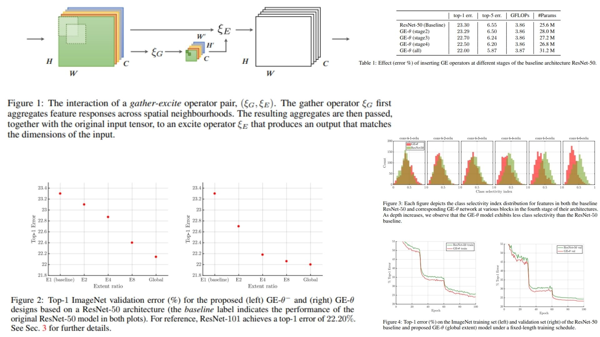

# 🚪 GE-Replication

This repository provides a **PyTorch replication** of the **Gather-Excite (GE)** framework, focusing on modeling global feature context to improve convolutional neural networks. It reconstructs the full pipeline from the original paper, including **context aggregation (gather), feature excitation (reweighting), and flexible operator design for context extraction**.

Paper reference: *Gather-Excite: Exploiting Feature Context in Convolutional Neural Networks*  https://arxiv.org/abs/1810.12348  

---

## Overview 🌌



> GE introduces a simple but effective idea: it first **aggregates global context from feature maps (gather)** and then **uses this context to reweight the original features (excite)**.

Key ideas:

- **Context Gathering (ξ)**: extracts global or spatial feature summaries  
- **Feature Excitation (ψ)**: reweights features using gathered context  
- **Flexible Design Space**: different gather strategies define different behaviors  
- **Lightweight Context Modeling** without heavy attention modules  

---

## Core Math 📐

**Feature map:**

$$
X \in \mathbb{R}^{C \times H \times W}
$$

**Gather operation:**

$$
g = \xi(X)
$$

**Excitation function:**

$$
s = \psi(g)
$$

**Final output:**

$$
Y = X \odot s
$$

**Optional channel-wise formulation:**

$$
s \in \mathbb{R}^{C \times 1 \times 1}
$$

---

## Why GE Matters ⚡

- Injects global context into local convolution features  
- Improves representation without heavy attention modules  
- Offers a flexible framework for designing context operators  
- Efficient and lightweight compared to complex attention blocks  

---

## Repository Structure 🏗️

```bash
GE-Replication/
├── src/
│   ├── blocks/
│   │   ├── gather.py
│   │   ├── excite.py
│   │   ├── ge_block.py
│   │   └── pooling.py
│   │
│   ├── modules/
│   │   ├── ge_basic_block.py
│   │   └── ge_resblock.py
│   │
│   ├── model/
│   │   ├── resnet_ge.py
│   │   └── classifier.py
│   │
│   └── config.py
│
├── images/
│   └── figmix.jpg
│
├── requirements.txt
└── README.md
```

---

## 🔗 Feedback

For questions or feedback, contact:  
[barkin.adiguzel@gmail.com](mailto:barkin.adiguzel@gmail.com)
